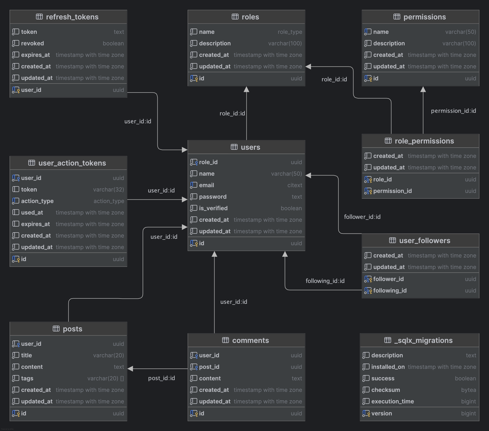

# Rust RESTful API with Axum, PostgreSql, Redis, and Email Verification

- [🧠 Application Overview](#-application-overview)
- [🧪 Database Schema](#-database-schema)
- [🚀 Features](#-features)
- [🛠️ Tech Stack](#-tech-stack)
- [🧰 How to Run the Application](#-how-to-run-the-application)
- [🔐 Authentication](#-authentication)
- [🔐 Authorization](#-authorization)
- [📌 API Documentation](#-api-documentation)

## 🧠 Application Overview

A scalable and modular RESTful API built with Rust using Axum, PostgreSql, Redis, and Email Verification. This application demonstrates CRUD functionality and follows best practices for structuring Rust web applications. It includes User Authentication using Refresh Token and Access Token mechanism, and User Authorization using Role Permission pattern.

## 🧱 Database Schema

See the `migrations/` directory for table definitions and sample data. The database structure is illustrated in the ERD:

---

## 🚀 Features
- RESTful API with structured endpoints.
- Modular architecture with separation of concerns.
- Middleware supported (e.g. Basic Authentication, Bearer Authentication, Role Permission, and Rate Limiting).
- Sending email when user register, reset password, and "welcome" stage.
- Combining Refresh Token + Access Token for better Authentication mechanism.
- Role Permission approach for User Authorization mechanism.
- Axum as web service framework. 
- PostgreSQL as relational database.
- Caching data using Redis (In-Memory database).
- SQLX as the async SQL toolkit for Rust database interaction.
- Database table relations (One-to-one, One-to-many, Many-to-many).
- Dockerized setup for easy deployment.
- Manual / local setup without docker.
---

## 🛠️ Tech Stack
This project uses these following main technologies:
- [Rust](https://github.com/rust-lang/rust) — Main programming language.
- [Tokio](https://github.com/tokio-rs/tokio) — Runtime for asynchronous Rust application.
- [Axum](https://github.com/tokio-rs/axum) — Web service framework.
- [PostgreSQL](https://github.com/postgres/postgres) — Relational database.
- [SQLX](https://github.com/launchbadge/sqlx) — The async SQL toolkit for Rust.
- [Redis](https://github.com/redis/redis`) — In-Memory database.
- Dockerfile & Docker Compose — For containerizing deployment.
---

## 🧰 How to Run the Application
There are two ways to run this application: using Docker (recommended for easy setup) or manually running it on your local machine. Choose one based on your preference.

### 📦 Option 1: Run with Docker (Recommended)
> This is the easiest way to get the app running. It uses Docker and Docker Compose to set up everything automatically.
> 
**1. Please ensure Docker is installed** on your machine.

**2. Clone the repository**:
```bash
$ git clone https://github.com/aryaadinulfadlan/axum-restful-api.git
$ cd axum-restful-api
```
**3. ENV Setup**, Please fill in these env variable with your credentials to enable Sending Email feature, In the `.env.example` file (**don't rename the file**):
```bash
SMTP_SERVER="smtp.mail.com"
SMTP_PORT=587
SMTP_USERNAME="your.email@mail.com"
SMTP_PASSWORD="your smtp password"
SMTP_FROM_ADDRESS="your.domain@mail.com"
```
If you don't setup these env variable, some feature is not enabled: **Sign Up and Reset Password**. Don't worry, you can use existing account for accessing endpoints.

**4. Build the application:**
```bash
$ docker-compose up --build
```
**5. You are all set. Feel free to access any of the available endpoints using Postman or curl to the main endpoint URL: http://localhost:4000/api/**

### 📦 Option 2: Run Locally (Without Docker)
> If you prefer running the application manually without Docker, follow these steps. Ensure you have **Rust v1.88.0**, **PostgreSQL v16.4**, **SQLX-CLI v0.8.6**, and **Redis v7.2.8** installed on your machine.

**1. Clone the repository**:
```bash
$ git clone https://github.com/aryaadinulfadlan/axum-restful-api.git
$ cd axum-restful-api
```

**2. ENV Setup**, Please rename the `.env.example` file to the `.env`. Fill in these env variable with your credentials to enable Sending Email feature:
```bash
SMTP_SERVER="smtp.mail.com"
SMTP_PORT=587
SMTP_USERNAME="your.email@mail.com"
SMTP_PASSWORD="your smtp password"
SMTP_FROM_ADDRESS="your.domain@mail.com"
```
If you don't setup these env variable, some feature is not enabled: **Sign Up and Reset Password**. Don't worry, you can use existing account for accessing endpoints.

**3. Make sure PostgreSQL is running on your local machine.**

**4. Please install SQLX-CLI on your local machine:**
```bash
$ cargo install sqlx-cli --no-default-features --features postgres
```
**5. Adjust the database URL in the `.env `file to match your own**
**6. Create a database:**
```bash
$ sqlx database create
```
**7. Run database migrations:**
```bash
$ sqlx migrate run
```
**8. Start Redis Server on your local machine:**
```bash
$ redis-server
```
**9. Run the application:**
```bash
$ cargo run
```
**10. You are all set. Feel free to access any of the available endpoints using Postman or curl to the main endpoint URL: http://localhost:4000/api/**

## 🔐 Authentication
This application supports two authentication methods: **Basic Authentication** and **Bearer Token Authentication (JWT)**.

#### 🔑 Basic Authentication
You can authenticate by sending your `username` and `password` using the `Authorization` header with the **Basic** scheme. Alternatively, for convenience, I've provided the username, password, and the pre-encoded Base64 string.
- username: **arya** (in the .env file)
- password: **arya123** (in the .env file)
- base64: **YXJ5YTphcnlhMTIz**

I only set up one endpoint that requires Basic Authentication, which is `/api/auth/basic`. You can try accessing this endpoint.

#### 🔑 Bearer Authentication
Once logged in using valid credentials, the server will return a Refresh Token and Access Token. The Refresh Token is stored automatically on your Cookie HttpOnly, so you don't have to worry about that. The Access Token is used for Header Authorization on every authenticated requests to access protected endpoints. The Access Token will expiry in **3600 seconds** (by default). After that, you need to request a new Access Token using `/api/auth/refresh` endpoint. Once the new Access Token is returned, please use it for your subsequest request. Once again, you don't have to worry about the Refresh Token.

---

## 🔐 Authorization
This application implements **role-based access control** with two user types:
- **Admin User**
- **Regular User**

Each user type has specific access rights to certain API endpoints. Regular users have **limited access** to the system. They are allowed to access only specific endpoints. Any attempt to access restricted endpoints will return a **403 Forbidden** response. Admin users have **full access** to all endpoints, including all the regular user endpoints.
Here are the accounts you can use to log in to this application:
- **Princess Diana (Admin User):**
    - Email: `princess_diana@gmail.com`
    - Password: `diana123`
- **Clark Kent (Regular User):**
    - Email: `clark_kent@gmail.com`
    - Password: `clark123`
- **Bruce Wayne (Regular User):**
    - Email: `bruce_wayne@gmail.com`
    - Password: `bruce123`

## 📌 API Documentation
Please see the `postman_collection.json` file for endpoint definitions and sample data.